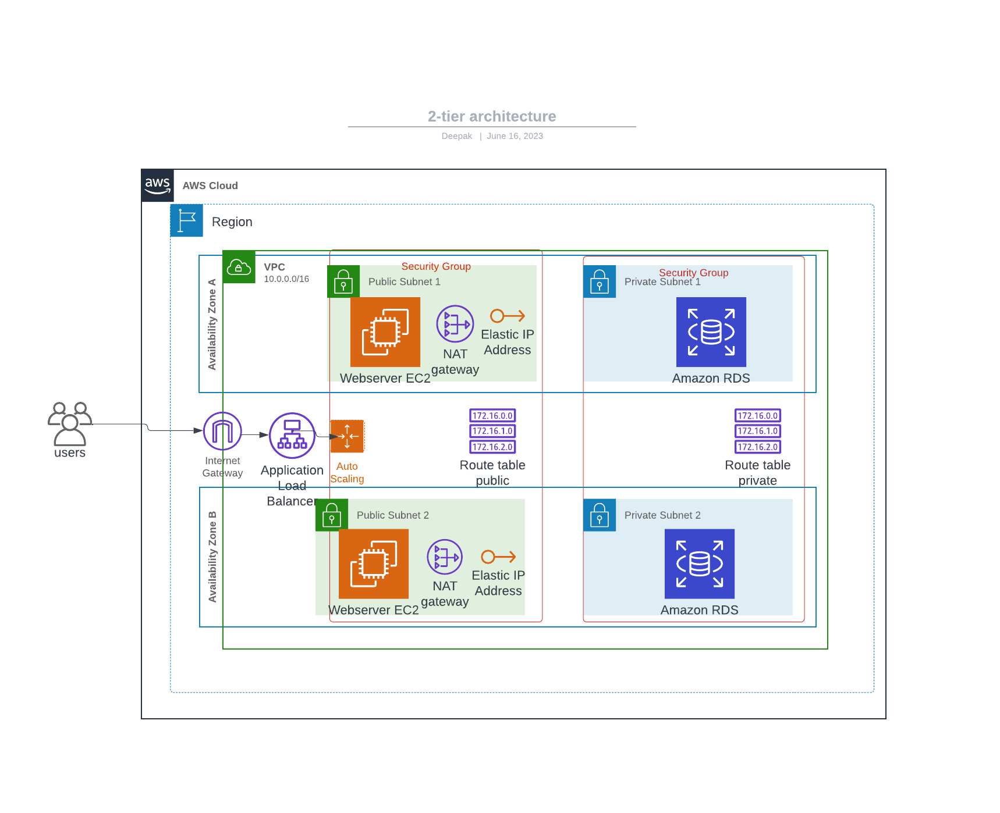

# App Deployment with 2-Tier Architecture on AWS

This repository contains the description of a 2-tier architecture on AWS for a FLASK App deployment. The architecture consists of the following main components - the VPC, the Application Tier, and the Database Tier.

## Architecture Overview

The 2-tier architecture on AWS for Flask app deployment looks like this:

## Overview of Components

### VPC (Virtual Private Cloud)
The Virtual Private Cloud provides a logically isolated section of the AWS Cloud where the web and database tiers are hosted. It allows fine-grained control over network configuration and provides the foundation for the entire architecture.

Components of the VPC:
1. **VPC**: A Virtual Private Cloud (VPC) is created to isolate the resources of the application and database tiers within the AWS Cloud.

2. **Subnets**: The architecture has two public subnets (public1 and public2) and two private subnets (private1 and private2). Public subnets are used for hosting EC2 instances in the Application Tier, while private subnets are used for the Database Tier and provide an additional layer of security.

3. **Internet Gateway**: An Internet Gateway is associated with the VPC, allowing instances in the public subnets to have outbound internet access.

4. **Elastic IP**: An Elastic IP is allocated to be used with the NAT Gateway, which provides a static public IP address for the NAT Gateway.

5. **NAT Gateway**: A NAT Gateway is associated with one of the public subnets (public2) to allow instances in private subnets to access the internet for software updates, license activation, etc., while keeping them protected from direct internet exposure.

6. **Route Tables**: Separate route tables are defined for public and private subnets to control traffic flow between them and to the internet.

### Application Tier
The Application Tier hosts the Flask app on EC2 instances behind an Application Load Balancer (ALB) for high availability and scalability.

Components of the Application Tier:
1. **EC2 Instances**: Two EC2 instances are launched in the public subnets. These instances run the Flask app and are managed by an Auto Scaling Group to ensure availability and scalability.

2. **Auto Scaling Group**: The Auto Scaling Group (ASG) automatically adjusts the number of EC2 instances based on traffic load, ensuring that the application can handle varying workloads and maintain performance.

3. **ALB (Application Load Balancer)**: The ALB evenly distributes incoming traffic across the EC2 instances in the Application Tier, providing high availability and fault tolerance.

4. **Security Groups**: The web_tier security group is associated with the EC2 instances, allowing inbound traffic on port 22 (SSH) and port 80 (HTTP) to the instances.

### Database Tier
The Database Tier consists of a managed Amazon RDS instance that provides data storage for the Flask app.

Components of the Database Tier:
1. **RDS (Relational Database Service)**: The RDS instance (the_db) is a managed MySQL database that provides data storage for the Flask app. It is placed in private subnets to restrict direct public access.

2. **RDS Subnet Group**: The RDS instance is associated with a subnet group (sub_4_db) containing private subnets (private1 and private2). This ensures that the database is not publicly accessible and is placed in different availability zones for high availability.

3. **Security Group**: The db_tier security group is associated with the RDS instance, allowing inbound traffic on port 3306 (MySQL) from the web_tier security group.

## Conclusion

This 2-tier architecture provides a scalable and reliable environment for deploying your Flask app on AWS. With an Application Load Balancer distributing traffic across multiple EC2 instances, a managed RDS database for data storage, and Auto Scaling Group for automatic scaling, the app can handle increased load.

